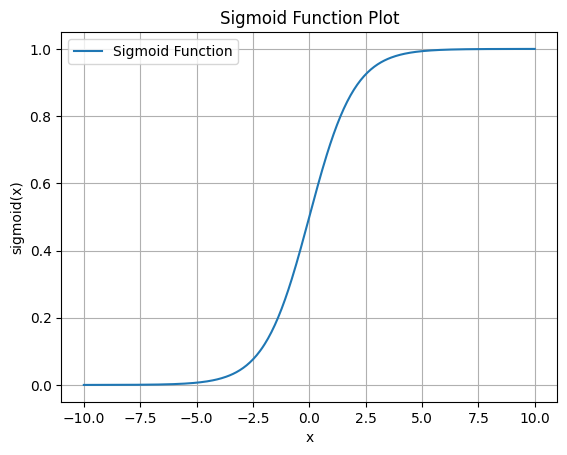

## Notation

- For a vector $x$ of $n$ features 
$$x = \begin{bmatrix}
        x_1\\
        x_2\\
        \vdots\\
        x_n
     \end{bmatrix}
$$
- Observations are marked with a superscript with parenthesis, observation $i$ for $x$: $x^{(i)}$
- Feature $i$ of observation $j$ for $x$ : $x_i^{(j)}$; or $f_i(c, x)$
- Estimations of classes, takes an ^ sign : $\hat{y}$

## Types of models

### Generative model

- for instance, the Naive Bayes model : $\hat{c} = \overbrace{P(d|c)}^{\text{likelihood}}\overbrace{P(c)}^{\text{prior}}$
- Makes use of the **likelihood**
-  _How to generate the features $d$ knowing the class $c$_

### Discriminative model

- Directly compute $P(c|d)$
- Discriminate between classes $c$ given some features $d$

## Logistic regression

- Need to add a bias term (or intercept)
$$
z = \Big(\sum_{i=1}^{n} w_i x_i \Big) + b = \bold{w.x} + b
$$

### Sigmoid function

$$
\sigma(z) = \frac{1}{1+e^{-z}}
$$

### Classification with logistic regression

- decision boundary: 
$$
\text{decision}(x) =
  \begin{cases}
  1 &\text{if}\ P(y=1|x) \gt 0.5 \\
  0 &\text{otherwise}
  \end{cases}
$$

### Vectorization of operations

- $m$ examples of $n$ features each :
$$
\textbf{X} =
\begin{pmatrix}
x_1^{(1)} & x_2^{(1)} & \dots & x_n^{(1)} \\
x_1^{(2)} & x_2^{(2)} & \dots & x_n^{(2)} \\
\vdots    & \vdots    &       & \vdots    \\
x_1^{(m)} & x_2^{(m)} & \dots &x_n^{(m)} 
\end{pmatrix}
$$
- rewriting the computations in vector form:
$$
\textbf{y} = \textbf{Xw + b}
$$

### Logistic regression vs Naive Bayes

- NB faster to train, works well on very small datasets.
- NB does not discriminate between features

### Multinomial logistic regression

- Switch the _sigmoid_ function by the _softmax_ function.
$$
\text{softmax}(z_i) = \cfrac{e^{z_i}}{\sum_{j=1}^{K} e^{z_j}},\ 1 \in \{1 .. K\}
$$
- Take the class with the highest probability :
$$
{\hat{\textbf{y}}} = \text{softmax}(\textbf{Wx} + \textbf{b})
$$

### Loss function

- $L(\hat{y}, y)$ : how much the estimated $\hat{y}$ differs from the true $y$

- **conditional maximum likelihood estimation** : maximizing the log probability of the true $y$ labels in the training data given the observations $x$
- Since classification reduced to a probability of a label being correct or not (1 or 0), it is a Bernouilli distribution. 
- Taking the log and making it negative to make it a loss function, we have the **negative log likelihood loss**, or **cross-entropy loss** :
$$
\log p(y|x) = y \log \hat{y} + (1-y) \log (1 - \hat{y})
$$

### Gradient descent

- Goal : minimize the weights $\theta$ ($w, b$ in logistic regression) :
$$
\hat{\theta} = \underset{\theta}{\argmin}\frac{1}{m}\sum_{i=1}^{m}L_{CE}(f(x^{i}; \theta), y^{(i)})
$$
- denoting the learning rate as $\eta$, the weights update is :
$$
\theta^{t+1} = \theta^{t} - \eta \nabla L(f(x; \theta), y)
$$

#### Gradient descent for logistic regression

$$
\frac{\partial L_{CE}(\hat{y}, y)}{\partial w_j} = -(y-\hat{y}) x_j
$$

#### Training on samples

- **Stochastic gradient descent** : Choosing an example randomly to perform a gradient descent
- **Batch training** : computing the gradient on the full dataset
- **Mini-batch** : group examples and perform batch gradient descent on the limited group.
    - use the average of the individual loss functions as the cost function

### Regularization

- Avoiding overfitting by adding a regulation term $R(\theta)$ to the objective function :
$$
\hat{\theta} = \underset{\theta}{\argmax} \sum_{i=1}^{m} \log P(y^{i}|x^{i}) - \alpha R(\theta)
$$

- **L2** regularization (Euclidean distance) - ridge regression :
  - easier to optimize (continuous derivative)
  - suitable for weight vectors with many small weights
  - akin to assume that weights follow a Gaussian distribution
$$
R(\theta) = \lVert \theta \rVert _2^2
$$
- **L1** regularization (Manhattan distance) - lasso regression :
  - suitable for sparse distribution
  - leads to fewer features
  - akin to a Laplace prior on weights
$$
R(\theta) = \lVert \theta \rVert _1 = |\theta|
$$

#### Multinomial logistic regression

$$
L_{CE}(\hat y, y) = - \log \cfrac {\exp(\bf{w_c.x} + b_c)} {\sum_{j=1}^K \exp (\bf{w_j.x} + b_j) }\quad \text{with c the correct class}
$$

$$
\frac{\partial L_{CE}(\hat{y}, y)}{\partial w_{k,i}} = - \bigg (y_k- \cfrac{\exp (\bf{w_k.x} + b_k)}{\sum_{j=1}^K (\exp \bf{w_k.x} + b_k)} \bigg) x_i
$$

### Interpretability of logistic regression

- Logistic regression is also one of the most useful analytic tools, because of its **ability to transparently study the importance of individual features.**