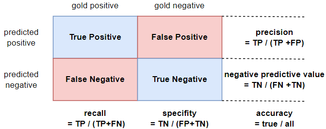

## Stats

### Model evaluation

#### Confusion matrix

- **F-measure**: $F_\beta = \frac{(\beta^2 + 1) PR}{\beta^2 B + R}$
- **F1-score** : $F_1 = \frac{2PR}{P+R}$

#### Concepts

- training set, development test set (devset), validation set
- k-fold cross-validation

- null hypothesis $H_0$
- **p-value** : $P(\delta(X) \ge \delta(x)\,|\,H_0)$
  - with $X$ a random variable ranging over all test sets
  - a small p-value means that the difference is very unlikely under the null hypothesis (typically .05 or .01 as threshold)
  - a small p-value means that the result is **statistically significant** and that the null hypothesis should be rejected. 
  

### Sampling

- approximate randomization
- bootstrap test
  - repeatedly drawing large numbers of samples with replacement

